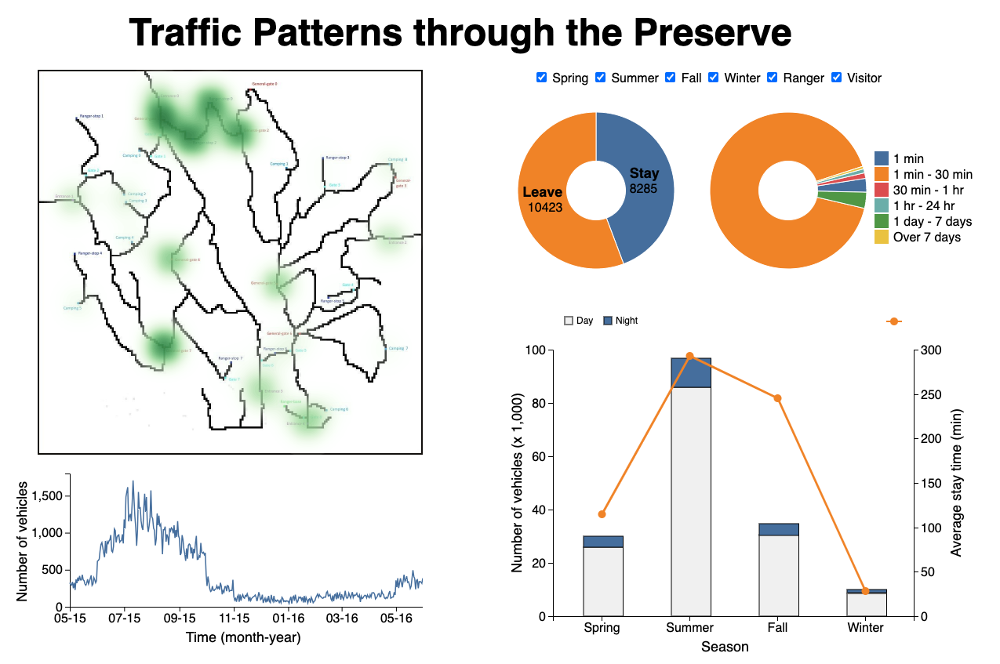

# Visual-analytic-system
### Yunbing Tan
---

This repository contains the relevant codes for a visual-analytic-system to analyze the tranfic patterns in a Preserve.

## Overview 
A screen shot of the visual analytic system is shown here.



The architecture of the visual-analytic-system is shown here.
- A compact database system that allows data retrieval using SQL syntax.

- Python functions to simplify data processing tasks and facilitate chart creation

- Four user interactive components:
  - A timeline chart that allows users to select a specific time range. As users adjust the timeline, other charts in the system update dynamically to reflect the chosen time interval.
  - A density map that allows users to select a range in the map. As selected, other charts in the system update dynamically to reflect the chosen location range.
  * A series of checkboxes that enable users to filter and find the data they need.
  * A tooltip function that allows users to check the value of each fraction of the pie charts


## Set up
- Requirement
  * python
  * pip
- Go to the directory ./backend
- Create a virtual environment called venv using the following command.
    ```bash
    python -m venv venv
    ```
- Activate the environment.
  * For windows:
    ```bash
    venv\Scripts\activate.bat
    ```
  * For Linux and MacOS:
    ```bash
    source ./venv/bin/activate
    ```
- Installing dependencies
    ```bash
    python app.py
    ```
- Double click the index.html file in ./frontend directory and the web page is open in the browser.
